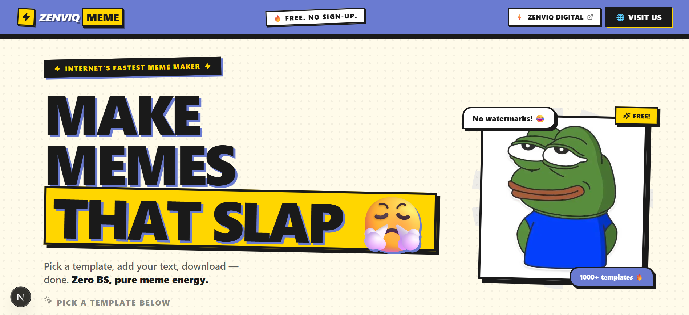

# ⚡ Zenviq Meme

> **The Internet's Fastest Meme Maker** — Pick a template, add your text, download. Zero BS, pure meme energy.



<div align="center">

[](https://zenviqdigital.in)
[](https://nextjs.org)
[](https://typescriptlang.org)
[](LICENSE)

</div>

---

## ✨ Features

| Feature | Description |
|---|---|
| 🖼️ **1000+ Templates** | Huge library of trending meme templates |
| 🔍 **Instant Search** | Find any template in seconds |
| ✏️ **Drag & Drop Editor** | Position text boxes anywhere on the image |
| 📤 **Custom Uploads** | Use your own image as a template |
| 💾 **Instant Download** | Download your meme as PNG with one click |
| 📋 **Copy to Clipboard** | Paste directly into chats |
| 🎨 **Rich Text Styling** | Fonts, colors, outlines, shadows, letter spacing |
| 🖊️ **Draw Mode** | Annotate or doodle directly on your meme |
| 📱 **Mobile Friendly** | Works seamlessly on any device |
| 🆓 **Completely Free** | No sign-up, no watermarks, no limits |

---

## 🛠️ Tech Stack

- **Framework** — [Next.js 15](https://nextjs.org) (App Router)
- **Language** — [TypeScript 5](https://typescriptlang.org)
- **Styling** — [Tailwind CSS v4](https://tailwindcss.com)
- **Animations** — [Framer Motion](https://framer.com/motion)
- **UI Components** — [shadcn/ui](https://ui.shadcn.com)
- **Icons** — [Lucide React](https://lucide.dev)
- **Fonts** — [Bricolage Grotesque](https://fonts.google.com/specimen/Bricolage+Grotesque) + [Epilogue](https://fonts.google.com/specimen/Epilogue)
- **Analytics** — [Vercel Analytics](https://vercel.com/analytics)

---

## 🚀 Getting Started

### Prerequisites

- **Node.js** 18.17 or later
- **npm** / **yarn** / **pnpm** / **bun**

### Installation

```bash
# 1. Clone the repo
git clone https://github.com/puri-adityakumar/meme-generator.git
cd meme-generator

# 2. Install dependencies
npm install

# 3. Start the dev server
npm run dev
```

Open [http://localhost:3000](http://localhost:3000) in your browser. 🎉

---

## 🎮 How to Use

1. **Browse Templates** — Scroll through 1000+ templates or search by name
2. **Upload Your Own** — Click "Upload Your Own" to use a custom image
3. **Edit Text** — Click a text box and type your caption
4. **Style It** — Change font, color, outline, shadow, and letter spacing
5. **Reposition** — Drag text boxes to place them exactly where you want
6. **Draw** — Use Draw Mode to annotate or doodle on the meme
7. **Download** — Hit the Download button to save your PNG

---

## 📁 Project Structure

```
src/
├── app/                    # Next.js App Router pages & layout
│   ├── layout.tsx          # Root layout with Navbar + Footer
│   ├── page.tsx            # Home page
│   └── globals.css         # Global styles + design system
├── components/
│   ├── Navbar.tsx          # Top navigation bar
│   ├── Footer.tsx          # Footer with copyright
│   ├── HeroSection.tsx     # Landing hero with mascot
│   ├── TemplateSearch.tsx  # Search bar component
│   ├── TemplateSelector.tsx# Template grid with pagination
│   ├── MemeEditor.tsx      # Core canvas editor
│   ├── CustomTemplateUpload.tsx # Custom image uploader
│   └── ui/                 # shadcn/ui base components
├── context/                # React Context (SelectedContext)
├── data/                   # Templates data & site config
├── hooks/                  # Custom hooks (useSelected)
├── lib/                    # Constants & utilities
└── types/                  # TypeScript type definitions
```

---

## 📜 Available Scripts

```bash
npm run dev      # Start development server
npm run build    # Build for production
npm run start    # Start production server
npm run lint     # Run ESLint
```

---

## 🤝 Contributing

1. Fork the repository
2. Create your feature branch — `git checkout -b feature/my-feature`
3. Commit your changes — `git commit -m 'feat: add my feature'`
4. Push to the branch — `git push origin feature/my-feature`
5. Open a Pull Request

---

## 📄 License

This project is open source and available under the [MIT License](LICENSE).

---

<div align="center">

**⚡ Powered by [Zenviq Digital](https://zenviqdigital.in)**

© 2026 Zenviq Meme. All rights reserved.

</div>
